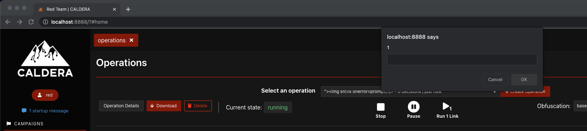
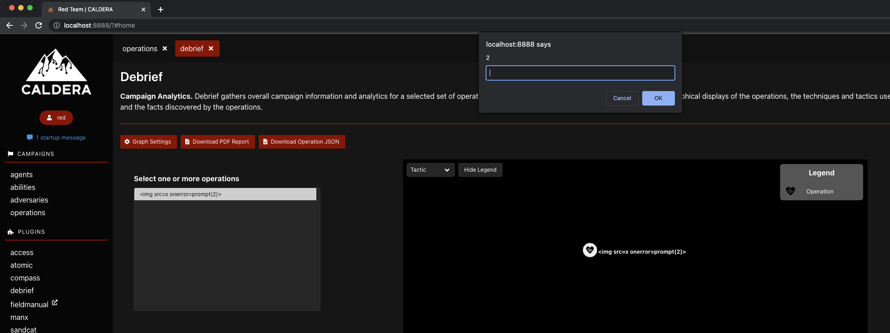

# Findings

## Stored XSS #1

**Description:** The first stored XSS was found during DEF CON 30
and was reported to the team at that time.

**Manual Reproduction:**

1. Create a Caldera test environment
2. Login to Caldera with the red user
3. Click **operations** in the left-hand menu
4. Click **Create Operation**
5. Provide the following input for the name:

   ```js
   ">
   ```

6. Click **Start**
7. Observe prompt:
   

**Remediation:**

Triaged by using JS breakpoints, DOMInvader, and manual investigation. Confirmed the xss exploit by using different xss techniques that took advantage of broken IMG tags.

Findings pointed toward unsanitized input being evaluated in the operation name portion of the toast() function. This function was derived from the bulma-toast JavaScript extension and helps create the dialog box notifying the user when an operation was started. 

The finding was patched by creating a sanitize() function which takes a string input, creates a DOMParser instance so that we can convert the string to HTML , then extracting its inner text. Effectively, this strips all HTML from the input string.

**State:** [Remediated](https://github.com/mitre/caldera/pull/2644)

---

## Stored XSS #2

**Description:** The second stored XSS was found after DEF CON 30.

**Manual Reproduction:**

1. Create a Caldera test environment
2. Login to Caldera with the red user
3. Click **operations** in the left-hand menu
4. Click **Create Operation**
5. Provide the following input for the name:

   ```js
   ">
   ```

6. Click **Start**
7. Click **debrief** in the left-hand menu
8. Select the operation created in the previous steps
9. Click the dropdown menu that
   currently reads **Attack Path** and change it to **Tactic**
10. Move your cursor over the name of the operation
11. Observe prompt:
    

**Remediation:**

The Debrief plugin contained a similar unsafe message input inside the graph.js script. In this case, a stored xss message could be referenced by a ToolTip function that displays information about the operation. Similar to the Operation bug, a malformed IMG tag in the name field allowed for xss. 

The finding was patched by passing the name field through the sanitize() function created in the first remediation effort.

**State:** [Remediated](https://github.com/mitre/debrief/pull/61)
